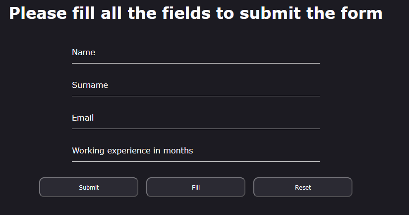

# TestForm

Simple form application

## Installing and running

1. Clone repository `git clone https://github.com/denkxi/test_form.git`
2. Open repository and run `npm install` in root folder to install all the dependencies
3. Run `ng serve` to start local server
4. Open **http://localhost:4200/** in browser

